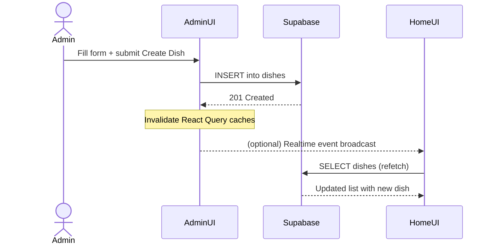

# Admin control of Home Page Food Items

This document describes how the admin panel manages dishes that appear on the website’s home page. It covers the feature description, implementation details (data model, APIs, frontend), UI design guidance, and a testing/validation plan tailored to this project’s stack: React + Vite + TypeScript + Tailwind, Clerk for auth, Supabase for data, and React Query for data fetching/caching.

## 1. Feature description

- Purpose: Allow authorized staff to add, edit, feature, or remove dishes from the catalog so the home page always reflects up-to-date offerings.
- Scope:
  - Create dish: Admin can add new dishes including name, description, price, image, category, availability, and featured flag.
  - Update dish: Admin can modify any attribute and toggle availability/featured status.
  - Delete dish: Admin can soft-delete or hard-delete based on policy (recommend soft-delete via `deleted_at`).
  - Home page visibility: New or updated dishes automatically appear on the home page list/sections (e.g., Featured, New, Categories) according to filters.
- Roles and permissions:
  - Visitor/Customer: Can read public dishes (only `is_available = true` and not soft-deleted).
  - Admin: Can manage dishes for their restaurant scope.
  - Super Admin: Full access across all restaurants/tenants.
  - Authentication and route guard: Clerk protects admin routes (see `src/components/ProtectedRoute.tsx`). Authorization is enforced server-side via Supabase Row Level Security (RLS) policies.

Success criteria
- After creating a dish in the admin panel, it appears in the relevant home page sections without a manual deploy/reload.
- Only authorized users can create/update/delete dishes; the public can only read.
- Changes are reflected within 1–2 seconds (via optimistic UI + cache invalidation and/or realtime updates).

## 2. Implementation details

### 2.1 Data model (Supabase)

Recommended tables (public schema):

1) restaurants
- id (uuid, pk)
- name (text, not null)
- slug (text, unique)
- created_at (timestamptz, default now())

2) categories
- id (uuid, pk)
- name (text, not null)
- slug (text, unique)
- created_at (timestamptz, default now())

3) dishes
- id (uuid, pk, default gen_random_uuid())
- restaurant_id (uuid, fk -> restaurants.id, not null, index)
- category_id (uuid, fk -> categories.id, nullable)
- name (text, not null)
- description (text)
- price (numeric(10,2) not null, check price >= 0)
- image_url (text)
- is_available (boolean not null default true)
- is_featured (boolean not null default false)
- tags (text[] default '{}')
- rating (numeric(2,1) default 0.0)
- created_at (timestamptz default now())
- updated_at (timestamptz default now())
- deleted_at (timestamptz null) — soft-deletion

Indexes
- dishes(restaurant_id)
- dishes(is_available)
- dishes(is_featured) include(id, name, price, image_url)
- dishes(category_id)

Storage
- Bucket: `dish-images` for images; store public or signed URLs in `image_url`.

Row Level Security (RLS) sketch
- Enable RLS on all three tables.
- Public read policy on `dishes` for anonymous/visitor: allow SELECT where `deleted_at is null and is_available = true`.
- Admin write policy on `dishes`: allow INSERT/UPDATE/DELETE where the user has role admin or super_admin and the row’s `restaurant_id` matches the admin’s scope.
- Role can be checked via:
  - A `profiles` table mapping `auth.uid()` to `role` and `restaurant_id`, or
  - JWT custom claims if using Clerk + Supabase JWT integration (e.g., `jwt()->>'role' IN ('admin','super_admin')`).

Example SQL snippets
```sql
-- dishes table
create table if not exists public.dishes (
  id uuid primary key default gen_random_uuid(),
  restaurant_id uuid not null references public.restaurants(id) on delete cascade,
  category_id uuid references public.categories(id) on delete set null,
  name text not null,
  description text,
  price numeric(10,2) not null check (price >= 0),
  image_url text,
  is_available boolean not null default true,
  is_featured boolean not null default false,
  tags text[] not null default '{}',
  rating numeric(2,1) not null default 0.0,
  created_at timestamptz not null default now(),
  updated_at timestamptz not null default now(),
  deleted_at timestamptz
);

alter table public.dishes enable row level security;

-- Public read of available dishes only
create policy "public_read_available_dishes" on public.dishes
for select using (
  deleted_at is null and is_available = true
);

-- Example admin write policy using a profiles table
-- profiles(user_id uuid pk, role text, restaurant_id uuid)
create policy "admins_manage_their_dishes" on public.dishes
for all using (
  exists (
    select 1 from public.profiles p
    where p.user_id = auth.uid()
      and p.role in ('admin','super_admin')
      and (p.role = 'super_admin' or p.restaurant_id = dishes.restaurant_id)
  )
)
with check (
  exists (
    select 1 from public.profiles p
    where p.user_id = auth.uid()
      and p.role in ('admin','super_admin')
      and (p.role = 'super_admin' or p.restaurant_id = dishes.restaurant_id)
  )
);
```

Type generation
- After creating tables, regenerate `src/integrations/supabase/types.ts` to get typed Supabase access in the frontend.

### 2.2 API layer

Option A — Direct Supabase client (recommended for this stack)
- Use `@supabase/supabase-js` in the admin panel for CRUD with RLS security.
- Home page uses `select` queries with filters and optionally real-time channel subscriptions.

Option B — REST API façade (if you prefer your own backend)
- Endpoints:
  - GET /api/dishes?available=true&featured=true&category={id}&limit=20&offset=0
  - POST /api/dishes
  - PATCH /api/dishes/:id
  - DELETE /api/dishes/:id
- Payload example
```json
{
  "restaurant_id": "uuid",
  "name": "Margherita Pizza",
  "description": "Classic pizza with mozzarella and basil",
  "price": 9.99,
  "image_url": "https://...",
  "category_id": "uuid",
  "is_available": true,
  "is_featured": true,
  "tags": ["vegetarian"]
}
```

### 2.3 Frontend data flow

- Data fetching: TanStack React Query
  - Home page query key: `['dishes','home',{category,isFeatured}]`
  - Admin list query key: `['dishes','admin',{filters}]`
  - Mutations: create/update/delete dish; on success, invalidate home and admin queries.

- Optional realtime updates: Supabase Realtime
  - Subscribe to `postgres_changes` on `dishes` for events INSERT/UPDATE/DELETE to update the home list live.
  - Fallback: periodic refetch (e.g., every 30–60s) or on visibility focus.

- Image upload flow
  1) Admin uploads image to `dish-images` bucket.
  2) Receive public URL or signed URL and store in `dishes.image_url`.
  3) Optimizations: limit size, generate responsive variants, use lazy loading on the home page.

- Validation: `zod` schema + `react-hook-form` in admin forms to enforce required fields and numeric ranges before submit.

Sequence (high level)


## 3. User interface design

General
- Use existing design system components in `src/components/ui` and patterns in admin layouts.
- Keep actions obvious: Add Dish button is primary; destructive actions require confirm dialog.

Admin Dishes List (table)
- Columns: [Select] | Image | Name | Category | Price | Available (toggle) | Featured (toggle) | Updated | Actions (Edit/Delete)
- Controls: Search by name/tag, Filter by category/availability/featured, Sort by updated/price/name, Pagination.
- Bulk actions: Toggle availability, delete, assign category.

Wireframe (table)
```
+-----------------------------------------------------------------------------------+
| Search [       ]  Category [All v]  Avail [All v]  Featured [All v]   + Add Dish  |
+-----------------------------------------------------------------------------------+
| [] | [img] | Margherita Pizza        | Pizza     | $9.99 | [ON ] | [OFF] | 1h ago | ⋮ |
| [] | [img] | Spicy Ramen             | Noodles   | $12.50| [OFF] | [ON ] | 2d ago | ⋮ |
| [] | [img] | Caesar Salad            | Salads    | $7.20 | [ON ] | [OFF] | 3d ago | ⋮ |
+-----------------------------------------------------------------------------------+
| « Prev | 1 | 2 | 3 | Next »                                                       |
+-----------------------------------------------------------------------------------+
```

Add/Edit Dish Modal
- Fields: name, description, price, category, tags (chips), availability toggle, featured toggle, image uploader with preview.
- Validation states inline; submit disabled until valid.
- Secondary actions: Save as Draft (if you support drafts), Delete (edit only).

Home Page presentation
- Sections: Featured dishes carousel/grid; Category sections; All dishes with infinite scroll or paginated grid.
- Performance: skeleton loaders (`ui/skeleton`), image lazy-loading, responsive srcsets.
- Accessibility: semantic headings, ARIA labels on toggles, sufficient contrast.

## 4. Testing and validation

Scope
- Ensure admin CRUD flows are reliable, secure, and reflected on the home page promptly and correctly.

Unit tests (React Testing Library + Vitest/Jest)
- Form validation via zod: invalid price, missing name -> errors shown, submit disabled.
- Toggling availability/featured calls the right mutation with expected payload.
- UI states: loading, empty, error, success toasts.

Integration tests (MSW + React Query)
- Mock Supabase HTTP interactions (or wrap a repository layer that you can mock), assert:
  - Creating a dish invalidates and refetches the home query.
  - Updates reflect in the admin list and home list.
  - Deleting sets `deleted_at` and hides the dish from home.

E2E tests (Playwright/Cypress)
- Scenario: Admin logs in (use Clerk test account) -> navigates to Admin Dishes -> adds a dish -> navigates to Home -> sees dish in Featured/All -> returns and toggles availability -> dish disappears from Home.
- Accessibility checks on admin forms and home listings.

Validation gates
- Data: Server-side RLS blocks unauthorized writes; public read only for available dishes.
- Performance: Home page LCP within target (optimize images/caching), API under acceptable latency.
- Observability: Console errors free; optional logging of mutation failures with retry/backoff.

Acceptance criteria checklist
- [ ] Creating a dish in admin displays it on the home page within 2s without a full page reload.
- [ ] Only admins/super admins can mutate dishes; visitors cannot.
- [ ] Feature/availability toggles immediately reflect on home after mutation.
- [ ] Soft-deleted dishes never show on home; can be restored only by admin.
- [ ] Images render with correct aspect ratio and responsive sizes.

---

Notes for this repository
- Auth: Clerk handles session; `ProtectedRoute` already guards admin routes. Add role awareness via Clerk public/organization metadata or a `profiles` table in Supabase.
- Data: Supabase `src/integrations/supabase/client.ts` is set up. After creating tables, regenerate types and use React Query for data orchestration.
- UI: Reuse components from `src/components/ui` and admin layouts under `src/components/layout`.
